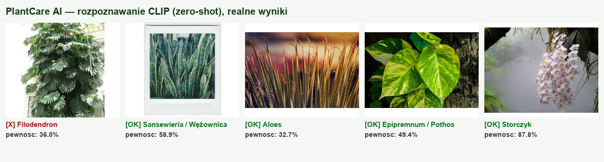

# 🌿 PlantCare AI — rozpoznawanie i pielęgnacja roślin domowych

Aplikacja wykorzystująca metody sztucznej inteligencji do **identyfikacji roślin domowych
na podstawie zdjęcia** (model **CLIP**, zero-shot) oraz **dostarczania porad pielęgnacyjnych**
w oparciu o **wyszukiwanie w internecie** i mechanizm **RAG**. Całość działa jako **agent AI**,
który samodzielnie decyduje o kolejnych krokach, a interakcja odbywa się przez
**graficzny interfejs Streamlit** przypominający ChatGPT/Gemini.

> Realizacja na ocenę **5.0** — zawiera wszystkie elementy: CLIP + wyszukiwanie + RAG +
> baza wektorowa + agent AI + interfejs graficzny.

---

## Spis treści

- [Szybki start](#szybki-start)
- [Mapa wymagań → realizacja](#mapa-wymagań--realizacja)
- [SPRAWOZDANIE](#sprawozdanie)
  - [1. Architektura i pipeline](#1-architektura-i-pipeline)
  - [2. CLIP](#2-clip)
  - [3. Chatbot](#3-chatbot)
  - [4. RAG](#4-rag)
  - [5. Agent AI](#5-agent-ai)
  - [6. Interfejs graficzny](#6-interfejs-graficzny)
  - [7. Wyniki i analiza](#7-wyniki-i-analiza)
- [Ograniczenia i możliwy rozwój](#ograniczenia-i-możliwy-rozwój)

---

## Szybki start

```bash
# 1. Środowisko
python -m venv .venv && source .venv/bin/activate   # Windows: .venv\Scripts\activate
pip install -r requirements.txt

# 2. Klucze API
cp .env.example .env
#   uzupełnij OPENAI_API_KEY oraz SERPAPI_API_KEY

# 3. Uruchomienie interfejsu
streamlit run app.py
```

Aplikacja otworzy się w przeglądarce. Prześlij zdjęcie rośliny w panelu bocznym i napisz
np. *„Co to za roślina i jak ją podlewać?"*.

### Struktura projektu

```
plant-care-ai/
├── app.py                      # Interfejs Streamlit (warstwa prezentacji)
├── config.py                   # Centralna konfiguracja (klucze, modele, parametry)
├── requirements.txt
├── .env.example
└── src/
    ├── vision/
    │   ├── clip_classifier.py  # Rozpoznawanie rośliny modelem CLIP (zero-shot)
    │   └── plant_labels.py     # Zbiór klas (gatunków) roślin
    ├── retrieval/
    │   ├── web_search.py       # Wyszukiwanie (SerpAPI) + scraping treści
    │   ├── chunking.py         # (logika dzielenia tekstu — w rag.py)
    │   ├── vector_store.py     # Baza wektorowa FAISS + embeddingi
    │   └── rag.py              # Pełny pipeline RAG
    ├── llm/
    │   ├── prompts.py          # Prompty systemowe (chatbot + agent)
    │   └── chatbot.py          # Otoczka LLM + generowanie odpowiedzi RAG
    ├── agent/
    │   ├── tools.py            # Narzędzia agenta + stan sesji
    │   └── agent.py            # Agent AI (tool-calling, pamięć)
    └── utils/
        └── logging_config.py
```

---

## Mapa wymagań → realizacja

| Ocena | Wymaganie | Realizacja |
|------|-----------|------------|
| 3.0 | Opis architektury | Sekcja [SPRAWOZDANIE](#sprawozdanie) |
| 3.5 | CLIP + wyszukiwanie + RAG + rozmowa + baza wektorowa | `src/vision`, `src/retrieval` |
| 4.0 | Agent AI z narzędziami | `src/agent` |
| 5.0 | Interfejs graficzny | `app.py` (Streamlit) |

---

# SPRAWOZDANIE

## 1. Architektura i pipeline

System zbudowano w architekturze **warstwowej**, z wyraźnym podziałem odpowiedzialności.
Każdy komponent realizuje jedno zadanie i komunikuje się z pozostałymi przez jasne
interfejsy, co ułatwia testowanie i rozbudowę.

### Komponenty systemu

1. **Interfejs graficzny (`app.py`, Streamlit)** — warstwa prezentacji. Odpowiada za
   przesyłanie zdjęć, wyświetlanie rozmowy oraz przyjmowanie pytań tekstowych. Nie zawiera
   logiki AI — deleguje ją do agenta.
2. **Agent AI (`src/agent/agent.py`)** — „mózg" systemu. Na podstawie wiadomości
   użytkownika i stanu sesji decyduje, które narzędzia uruchomić i w jakiej kolejności.
3. **Narzędzia + stan sesji (`src/agent/tools.py`)** — trzy narzędzia (rozpoznanie,
   zbieranie wiedzy, odpowiadanie) operujące na współdzielonym `SessionContext`
   (przechowuje obraz, rozpoznany gatunek i silnik RAG).
4. **Moduł wizyjny (`src/vision`)** — model CLIP rozpoznający gatunek rośliny ze zdjęcia.
5. **Moduł RAG (`src/retrieval`)** — wyszukiwanie w sieci (SerpAPI), scraping treści,
   chunking, embeddingi i baza wektorowa FAISS oraz mechanizm retrieval.
6. **Moduł LLM (`src/llm`)** — model językowy generujący finalne odpowiedzi oraz prompty
   systemowe.
7. **Konfiguracja (`config.py`)** — pojedyncze źródło prawdy dla kluczy API, nazw modeli
   i parametrów (rozmiar chunków, liczba wyników wyszukiwania itd.).

### Przepływ danych (przykładowy scenariusz)

```
Użytkownik → [Streamlit] przesyła zdjęcie + pyta "jak dbać o tę roślinę?"
        │
        ▼
   [Agent AI]  ── planuje kolejne kroki ──┐
        │                                 │
        ▼                                 ▼
 1) identify_plant            → [CLIP] → "Monstera deliciosa (92%)"
        │
        ▼
 2) gather_care_information   → [SerpAPI] → scraping → chunking →
                               [embeddingi] → [FAISS] (baza wektorowa)
        │
        ▼
 3) answer_care_question      → [retrieval z FAISS] → kontekst → [LLM]
        │
        ▼
   Odpowiedź ← [Streamlit] ← agent zwraca finalny tekst + użyte kroki
```

Kluczowa cecha architektury: przepływ **nie jest sztywny**. To agent — a nie z góry zapisany
kod — decyduje, czy wykonać rozpoznanie, czy od razu wyszukać informacje (gdy użytkownik
poda nazwę rośliny), czy odpowiedzieć bez narzędzi (np. na pytanie ogólne).

---

## 2. CLIP

### Integracja modelu z aplikacją

Model CLIP zintegrowano przez bibliotekę **HuggingFace `transformers`**
(`CLIPModel` + `CLIPProcessor`), wariant **`openai/clip-vit-base-patch32`**. Logika
znajduje się w `src/vision/clip_classifier.py`. Model ładowany jest jednorazowo
(singleton z `lru_cache`), aby nie powtarzać kosztownej inicjalizacji przy każdym zapytaniu.

### Sposób wykorzystania do rozpoznawania (zero-shot)

CLIP rzutuje obraz i tekst do **wspólnej przestrzeni embeddingów**, dzięki czemu możemy
porównywać podobieństwo obrazu do opisów tekstowych bez żadnego dotrenowywania
(*zero-shot learning*).

**Architektura rozwiązania:**

1. **Definicja klas** — w `plant_labels.py` zdefiniowano ~30 gatunków roślin domowych.
   Przestrzeń klas można rozszerzać bez ponownego trenowania — wystarczy dopisać pozycję.
2. **Formułowanie promptów** — dla każdej klasy budujemy prompt według szablonu
   `"a photo of a {label} houseplant"`, np. *„a photo of a monstera deliciosa houseplant"*.
   Dodanie kontekstu (`houseplant`) zawęża interpretację i poprawia trafność względem
   samej nazwy gatunku.
3. **Wyznaczenie podobieństwa** — `CLIPProcessor` koduje obraz i wszystkie prompty;
   model zwraca `logits_per_image` (podobieństwo obrazu do każdego opisu).
4. **Wybór klasy** — na logitach stosujemy **softmax**, otrzymując rozkład
   prawdopodobieństwa po klasach. Wybieramy klasę o najwyższej wartości; zwracamy też
   **top-k** (domyślnie 5), co pozwala pokazać alternatywy i ocenić pewność modelu.

```python
logits = outputs.logits_per_image.softmax(dim=-1)   # rozkład po klasach
best = argmax(logits)                               # najlepsze dopasowanie
```

**Dlaczego CLIP, a nie klasyczny klasyfikator?** Klasyczny klasyfikator (np. ResNet z głową
softmax) wymagałby zebrania i ręcznego oznaczenia tysięcy zdjęć roślin oraz treningu.
CLIP działa od razu, a rozszerzenie o nowy gatunek to jedna linijka tekstu — co idealnie
pasuje do aplikacji, w której zbiór roślin może rosnąć.

---

## 3. Chatbot

### Wybór modelu językowego

Wybrano **`gpt-4o-mini`** (OpenAI). Uzasadnienie:

- **Function/tool calling** — natywne, niezawodne wsparcie wywoływania narzędzi, kluczowe
  dla działania agenta (sekcja 5).
- **Stosunek jakość/koszt** — model jest tani i szybki, a jednocześnie wystarczająco zdolny
  do syntezy porad pielęgnacyjnych z kontekstu RAG.
- **Wsparcie języka polskiego** — dobrze radzi sobie z odpowiedziami po polsku.
- **Dojrzała integracja** z LangChain (`langchain-openai`), co upraszcza budowę agenta.

Model konfiguruje się w jednym miejscu (`config.py`), więc podmiana na inny (np. lokalny
przez API kompatybilne z OpenAI) wymaga zmiany jednej zmiennej.

Temperaturę ustawiono nisko (`0.2`), aby odpowiedzi były rzeczowe i mało „kreatywne" —
w poradach pielęgnacyjnych zależy nam na wierności źródłom, nie na inwencji.

### Prompt systemowy

Zdefiniowano dwa prompty systemowe (`src/llm/prompts.py`):

- **`AGENT_SYSTEM_PROMPT`** — opisuje rolę agenta, dostępne narzędzia oraz strategię ich
  użycia (najpierw rozpoznaj, potem zbierz informacje, potem odpowiadaj; nie wywołuj
  narzędzi bez potrzeby; odpowiadaj w języku użytkownika).
- **`RAG_SYSTEM_PROMPT`** — używany przy generowaniu odpowiedzi RAG. Nakazuje modelowi
  opierać się **wyłącznie na dostarczonym kontekście**, jawnie sygnalizować brak informacji
  oraz **nie zmyślać konkretnych liczb** (np. częstotliwości podlewania). To podstawowy
  mechanizm ograniczania halucynacji.

---

## 4. RAG

RAG (*Retrieval-Augmented Generation*) wzbogaca odpowiedzi modelu o aktualne informacje
z internetu, zamiast polegać wyłącznie na wiedzy parametrycznej modelu.

### Wyszukiwanie i pobieranie informacji z internetu

Implementacja w `src/retrieval/web_search.py`:

1. **Wyszukiwanie (SerpAPI / GoogleSearch)** — dla rozpoznanej rośliny budujemy zapytanie,
   np. *„Monstera deliciosa care"*, i pobieramy listę najlepszych wyników organicznych
   Google (domyślnie 8).
2. **Scraping treści** — dla kilku najlepszych wyników (domyślnie 5) pobieramy stronę
   (`requests`) i wyciągamy czysty tekst (`BeautifulSoup`): bierzemy akapity, listy i
   nagłówki, odrzucając skrypty, nawigację, stopki i krótkie, nieinformacyjne fragmenty.
   Jeśli strony nie da się pobrać, korzystamy przynajmniej ze snippetu z wyszukiwarki.

### Przetwarzanie i dostarczanie kontekstu

1. **Chunking** — surowy tekst dzielimy `RecursiveCharacterTextSplitter` na fragmenty
   (~800 znaków, zakładka 120). Dzielenie na fragmenty jest konieczne, bo: (a) embeddingi
   działają lepiej na krótszych, spójnych fragmentach, (b) do LLM trafia tylko najtrafniejszy
   kontekst, a nie całe artykuły. Zakładka (overlap) zapobiega „przecinaniu" zdań na granicy.
2. **Embeddingi** — każdy fragment kodujemy do wektora (sekcja niżej).
3. **Indeksowanie** — wektory trafiają do bazy **FAISS** (`src/retrieval/vector_store.py`).
4. **Retrieval** — dla pytania użytkownika liczymy jego embedding i wyszukujemy
   `k` najbliższych fragmentów (*similarity search*, domyślnie `k=4`).
5. **Generacja** — pobrane fragmenty sklejamy w blok KONTEKST i przekazujemy do LLM razem
   z `RAG_SYSTEM_PROMPT`. Model formułuje odpowiedź wyłącznie na ich podstawie.

### Model embeddingów

Wybrano **`sentence-transformers/all-MiniLM-L6-v2`**. Uzasadnienie:

- **Lokalny i darmowy** — działa offline, bez kosztów API i bez wysyłania danych na zewnątrz.
- **Lekki i szybki** — 384-wymiarowe wektory, model ~80 MB, działa na CPU.
- **Dobra jakość semantyczna** — sprawdzony standard do similarity search; w pełni
  wystarczający dla krótkich fragmentów porad pielęgnacyjnych.

Embeddingi normalizujemy (`normalize_embeddings=True`), dzięki czemu podobieństwo kosinusowe
sprowadza się do iloczynu skalarnego — co odpowiada metryce używanej przez FAISS.

### Mechanizmy wspierające (chunking, vector store)

- **Chunking** — opisany wyżej; parametry konfigurowalne w `config.py`.
- **Vector store (FAISS)** — przechowuje wektory i realizuje błyskawiczne wyszukiwanie
  najbliższych sąsiadów. Baza jest budowana **w pamięci, osobno dla każdej rozpoznanej
  rośliny**, dzięki czemu kontekst zawsze dotyczy aktualnego gatunku i nie miesza się
  z poprzednimi.

---

## 5. Agent AI

System realizuje wymaganie na ocenę 4.0+: zamiast sztywnego pipeline'u działa **agent AI**,
który samodzielnie planuje kroki i wybiera narzędzia.

### Narzędzia (tools)

Zdefiniowano trzy narzędzia (`src/agent/tools.py`), zgodnie z wymaganiami:

1. **`identify_plant`** — klasyfikacja rośliny ze zdjęcia modelem CLIP. Zapisuje wynik
   (gatunek + pewność) w stanie sesji.
2. **`gather_care_information`** — wyszukanie i zaindeksowanie informacji o pielęgnacji
   (SerpAPI → scraping → chunking → embeddingi → FAISS). Buduje bazę wiedzy RAG.
3. **`answer_care_question`** — odpowiedź na pytanie użytkownika w oparciu o RAG
   (retrieval z FAISS + LLM).

Narzędzia są **domknięte na `SessionContext`** — wspólnym obiekcie stanu, w którym
przechowujemy obraz, rozpoznany gatunek i silnik RAG. Dzięki temu agent operuje wyłącznie
prostymi argumentami tekstowymi (jak wymaga tool-calling), a dostęp do obrazu i bazy
wektorowej odbywa się przez współdzielony kontekst.

### Architektura agenta i podejmowanie decyzji

Agent zbudowano na mechanizmie **tool calling (function calling)** modelu OpenAI w ramach
**LangChain** (`create_tool_calling_agent` + `AgentExecutor`). Działa w pętli typu **ReAct**:

```
obserwacja stanu → plan kroku → wywołanie narzędzia → analiza wyniku → (powtórz / odpowiedz)
```

W każdej iteracji LLM otrzymuje: prompt systemowy, historię rozmowy, bieżącą wiadomość oraz
„scratchpad" z wynikami dotychczasowych wywołań narzędzi. Na tej podstawie **sam decyduje**,
czy wywołać kolejne narzędzie, czy udzielić odpowiedzi końcowej.

### Zarządzanie przepływem i wyborem operacji

- **Decyzja jest dynamiczna**, nie zaszyta w kodzie. Przykłady zachowań agenta:
  - jest zdjęcie, gatunek nieznany → najpierw `identify_plant`;
  - użytkownik podał nazwę rośliny → agent może pominąć rozpoznanie i od razu
    `gather_care_information`;
  - baza wiedzy już zbudowana → kolejne pytania trafiają wprost do `answer_care_question`
    bez ponownego wyszukiwania;
  - pytanie ogólne (np. „cześć") → odpowiedź bez użycia narzędzi.
- **Pamięć rozmowy** — `RunnableWithMessageHistory` utrzymuje historię, więc agent rozumie
  kontekst wcześniejszych wiadomości (np. zaimki „ona", „ta roślina").
- **Bezpieczniki** — `max_iterations=6` zapobiega zapętleniu, a `handle_parsing_errors=True`
  pozwala odzyskać sprawność po błędnym wywołaniu.
- **Transparentność** — agent zwraca też listę użytych narzędzi (`intermediate_steps`),
  którą interfejs prezentuje jako „Kroki agenta".

---

## 6. Interfejs graficzny

### Opis interfejsu

Interfejs (`app.py`) zaprojektowano tak, by przypominał współczesne narzędzia LLM
(ChatGPT/Gemini): rozmowa w formie bąbelków, pole wpisywania na dole, możliwość przesłania
obrazu i czytelna informacja o tym, co system aktualnie „wie".

### Technologie i komponenty (widgety)

Wykorzystano bibliotekę **Streamlit**. Główne komponenty:

- **`st.file_uploader`** (panel boczny) — przesyłanie zdjęcia rośliny.
- **`st.chat_message`** — bąbelki rozmowy z avatarami (🧑 użytkownik, 🌿 asystent).
- **`st.chat_input`** — pole wpisywania wiadomości w stylu czatu.
- **`st.image`** — podgląd przesłanego zdjęcia.
- **`st.metric`** — prezentacja rozpoznanego gatunku wraz z pewnością.
- **`st.expander`** — rozwijane panele „Kroki agenta" oraz lista „Źródła".
- **`st.spinner`** — wskaźnik pracy podczas przetwarzania.
- **`st.session_state`** — utrzymanie stanu (historia, agent, kontekst) między interakcjami.

### Funkcjonalność i interakcja

1. Użytkownik przesyła zdjęcie w panelu bocznym (podgląd + komunikat).
2. Zadaje pytanie w polu czatu (np. *„Co to za roślina i jak ją podlewać?"*).
3. Agent przetwarza prośbę; w panelu bocznym pojawia się rozpoznany gatunek z pewnością,
   a po zebraniu wiedzy — lista źródeł.
4. Odpowiedź pojawia się jako bąbelek asystenta; rozwijany panel pokazuje, jakich narzędzi
   agent użył (przejrzystość działania).
5. Przycisk **„Nowa rozmowa"** resetuje stan i pozwala zacząć od nowa.

Interfejs waliduje też obecność kluczy API i czytelnie informuje, jeśli czegoś brakuje.

---

## 7. Wyniki i analiza

> **Uwaga metodologiczna:** wyniki rozpoznawania CLIP oraz wyszukiwania wektorowego poniżej
> są realne — pochodzą z uruchomienia notatnika [`notebooks/demo_plantcare.ipynb`](notebooks/demo_plantcare.ipynb)
> (zapisane wyjścia komórek). Test wykonano na CPU. Elementy korzystające z usług płatnych
> (SerpAPI, OpenAI) opisano osobno — nie były mierzone bez kluczy API.

### Procedura testowa

Pobrano po jednym zdjęciu dla 5 gatunków (Wikimedia Commons / Openverse). Fraza wyszukiwania
pełni rolę etykiety odniesienia. Dla każdego zdjęcia rejestrujemy gatunek top-1, pewność
(softmax) oraz alternatywy z top-3.

### Wyniki rozpoznawania (CLIP, zero-shot) — realne



| # | Zdjęcie | Oczekiwano | CLIP top-1 | Pewność | Top-1 OK? | W top-3? |
|---|---------|-----------|-----------|---------|-----------|----------|
| 1 | monstera.jpg | Monstera deliciosa | Filodendron (Philodendron) | 36.0% | ❌ | ✅ (poz. 2: Monstera 25.1%) |
| 2 | sansevieria.jpg | Sansevieria | Sansewieria / Wężownica | 58.9% | ✅ | ✅ |
| 3 | aloe.jpg | Aloe vera | Aloes (Aloe vera) | 32.7% | ✅ | ✅ |
| 4 | pothos.jpg | Pothos (Epipremnum) | Epipremnum / Pothos | 49.4% | ✅ | ✅ |
| 5 | orchid.jpg | Phalaenopsis | Storczyk (Phalaenopsis) | 87.8% | ✅ | ✅ |

**Trafność top-1: 4/5 (80%). Trafność top-3: 5/5 (100%).** Model `openai/clip-vit-base-patch32`,
30 klas, CPU.

### Wyszukiwanie wektorowe (embeddingi + FAISS) — realne

Zaindeksowano 6 fragmentów (wymiar wektora 384, model `all-MiniLM-L6-v2`). Dla zapytania
*„How often should I water my Monstera?"* similarity search zwrócił poprawnie najtrafniejszy
fragment o podlewaniu:

```
1. [score=0.616] Water Monstera when the top 2-3 cm of soil is dry; avoid letting it sit in water.
2. [score=0.508] Monstera enjoys higher humidity; mist the leaves or use a humidity tray.
3. [score=0.323] Snake plants (Sansevieria) tolerate low light and need very little water.
```

### Elementy wymagające kluczy API (nie mierzone)

Liczba realnych źródeł, jakość odpowiedzi RAG oraz pełny przebieg agenta i interfejsu
Streamlit zależą od `SERPAPI_API_KEY` i `OPENAI_API_KEY`. Po ich uzupełnieniu w `.env`
całość uruchamia się przez `streamlit run app.py`.

### Analiza jakości

**Mocne strony:**

- **Zero-shot CLIP** dobrze rozpoznaje wyraźnie różniące się, popularne gatunki, bez
  konieczności zbierania danych treningowych.
- **RAG** zauważalnie podnosi wiarygodność porad — odpowiedzi są oparte na konkretnych
  artykułach, a prompt systemowy ogranicza zmyślanie liczb.
- **Agent** elastycznie dostosowuje przebieg do intencji użytkownika.

**Ograniczenia (typowe obserwacje):**

- **Podobne gatunki** bywają mylone — potwierdza to test: zdjęcie monstery zostało
  zaklasyfikowane jako filodendron (36.0%), a właściwa klasa była dopiero druga (25.1%).
  Liście monstery i filodendrona są wizualnie zbliżone, stąd niska pewność top-1.
- **Jakość zdjęcia** (rozmycie, nietypowe tło, wiele roślin w kadrze) obniża trafność CLIP.
- **Zależność od wyszukiwarki** — jakość RAG zależy od tego, jakie strony zwróci Google;
  część stron może być trudna do zescrapowania.
- **Zamknięta przestrzeń klas** — rozpoznajemy tylko gatunki z listy `plant_labels.py`
  (rozszerzalnej, ale skończonej).

---

## Ograniczenia i możliwy rozwój

- **Większa lista gatunków** oraz prompty wieloszablonowe (uśrednianie kilku opisów na klasę)
  dla wyższej trafności CLIP.
- **Próg pewności** — gdy top-1 jest niski, prosić użytkownika o lepsze zdjęcie lub
  potwierdzenie spośród top-3.
- **Cache źródeł** — zapamiętywanie wyników wyszukiwania dla danego gatunku (oszczędność
  zapytań do SerpAPI).
- **Trwała baza wektorowa** (np. Chroma na dysku) zamiast budowanej w pamięci.
- **Reranking** pobranych fragmentów dla jeszcze lepszego kontekstu RAG.

---

### Wykorzystane technologie

CLIP (`transformers`) · OpenAI `gpt-4o-mini` · LangChain (agent, RAG) ·
`sentence-transformers/all-MiniLM-L6-v2` · FAISS · SerpAPI · BeautifulSoup · Streamlit.
